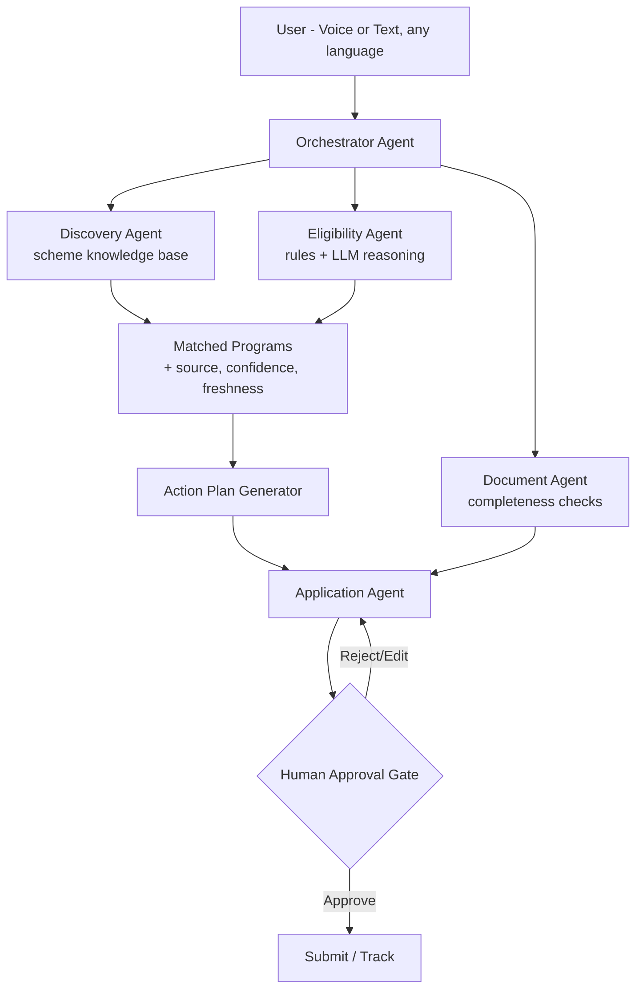

# Sahaay — Benefits Navigator Agent
### Implementation Plan · Agentic AI For Billions · Built with Google Antigravity + Groq API

**Scope for the hackathon:** 3–5 real schemes across welfare, education, and healthcare (not "all schemes") — one flawless end-to-end demo flow, structured to extend later. Example: a student in Karnataka asks about scholarships → research → eligibility → document check → application prep → human-approved submission → tracking.

**Assumptions (adjust if wrong):** ~36–48 hour build window, team of 3–4, India-focused demo (Kannada + Hindi + English).

---

## 1. System Architecture

| Agent | Role | Notes |
|---|---|---|
| **Orchestrator** | Routes intent, holds conversation state | Only agent the user directly talks to |
| **Discovery Agent** | Matches user profile → candidate schemes | RAG over a curated, structured scheme KB (not open web search) |
| **Eligibility Agent** | Runs eligibility checks with explanations | Rules engine first; LLM only for ambiguous criteria |
| **Document Agent** | Format/completeness checks on uploads | Never claims authenticity — flags for human review |
| **Application Agent** | Pre-fills forms / drafts documents | Uses Antigravity's browser agent for portals with no API |
| **Tracking Agent** | Monitors application status | Scheduled background task |
| **Human-Approval Gate** | Hard stop before any submission or PII share | First-class UI moment, not a footnote |

Every claim-producing node carries `source_url`, `confidence`, `evidence`, and `last_verified` through the pipeline — the trust layer is a data-shape decision made on day one, not a UI feature bolted on later.

---

## 2. Tech Stack

| Layer | Choice | Why |
|---|---|---|
| LLM reasoning | **Groq API** (Llama 3.3 70B, OpenAI-compatible endpoint) — powers Orchestrator, Discovery, Eligibility, Application agents | Fast enough for live voice demo latency to feel natural |
| Speech-to-text | **Groq `whisper-large-v3-turbo`** | Fast, multilingual, same provider as reasoning = fewer moving parts |
| Text-to-speech | **Sarvam AI or Bhashini** | Groq's TTS is English-only; Indic output needs a second provider — verify current API surface before committing code |
| Dev/orchestration environment | **Google Antigravity** — Agent Manager for parallel agent execution, MCP servers wrapping the scheme KB, browser agent for form-filling, Artifacts for the audit trail | Matches the multi-agent architecture directly onto parallel dev tracks |
| Interface | **Web widget for the demo** (fast, reliable, no external approvals needed); WhatsApp/IVR as the post-hackathon rollout path | WhatsApp Business API setup is real added risk inside a 36–48hr window unless your team already has access |
| Scheme KB | Versioned structured dataset (JSON/DB) with 10–15 real schemes and real source URLs | Update without redeploying; curate by hand rather than live-scrape gov portals |

---

## 3. Splitting the build across Antigravity agents

Give each Antigravity dev-agent a scoped, written task spec — this is what makes parallel agent work safe rather than a merge-conflict machine. **Lock the API contract from agent 1 before the others start.**

1. **Backend/Orchestrator agent** — FastAPI skeleton, state-machine/LangGraph orchestration, Groq call wrapper, API contracts for everyone else.
2. **Discovery agent** — curate the scheme dataset, build retrieval, return results with source+date metadata via an MCP server.
3. **Eligibility + Document agent** — rules engine (income/state/occupation matching) plus completeness checker (file present, name match, expiry flag).
4. **Frontend agent** — chat UI, language switcher, the final-application-review screen with an explicit Approve/Edit button.
5. **Voice/i18n agent** — Whisper STT + Sarvam/Bhashini TTS wiring, LLM-based translation between UI language and orchestrator's working language.
6. **QA/Demo agent** — runs the full flow in Antigravity's real browser tool, produces a walkthrough artifact, flags broken states before the live demo.

---

## 4. Phased Build Timeline

| Phase | Hours | Deliverable |
|---|---|---|
| 0 — Setup | 0–2 | Scheme KB schema, Antigravity scaffolding, Groq API keys, API contract locked |
| 1 — Core logic | 2–10 | Rules engine + Eligibility Agent with explanation output (no voice yet) |
| 2 — Voice/multilingual front door | 10–20 | STT/TTS wired to Discovery + Eligibility |
| 3 — Application flow | 20–30 | Application Agent (1 scheme first) + human-approval gate |
| 4 — Tracking | 30–36 | Tracking Agent as background task |
| 5 — Polish & pre-launch | 36–44 | Full checklist below, rehearse one flawless demo scenario |
| 6 — Buffer | 44–48 | Whatever broke, deck, submission |

---

## 5. Scope Guardrails — say these out loud in the pitch

- No live scraping of or submission to real government portals — curated data with real citations; the "submit" step is simulated, and you say so.
- No claims of document authenticity — completeness/format checks only, explicitly labeled.
- No fully autonomous submission — the human-approval gate is a feature, not a limitation.

---

## 6. Pre-Launch Checklist

| # | Item | Priority for this project |
|---|---|---|
| 1 | Privacy policy page | **High** — you're handling eligibility/PII data |
| 2 | Terms & conditions | Cover that the agent assists but doesn't guarantee outcomes |
| 3 | Secrets off the frontend | **Critical** — Groq key and any portal credentials server-side only |
| 4 | Force HTTPS | Non-negotiable given PII in transit |
| 5 | Cookie consent banner | Only if shipping the web widget publicly |
| 6 | Meta titles/descriptions | Low priority for MVP |
| 7 | Social preview image | Useful before sharing the demo link with judges |
| 8 | Favicon | Quick win, do last |
| 9 | Sitemap/robots.txt | Low priority for MVP |
| 10 | Alt text on images | Matters given your own accessibility claims |
| 11 | Compress images | Keep the demo fast on low-bandwidth — same audience you're targeting |
| 12 | Page load speed | **Relevant** — test on throttled 3G |
| 13 | Color contrast | Part of accessibility scoring if judges check |
| 14 | Mobile friendly | **High** — this audience is mobile-first |
| 15 | Custom 404 | Low priority |
| 16 | Fix broken links | Check before demo day |
| 17 | Form validation | **High** — validate before data reaches the Application Agent |
| 18 | Spam/rate limiting | **Load-bearing** — protect the public endpoint from judge/audience traffic and Groq rate limits |
| 19 | Analytics | Useful for judging, log only what's needed |
| 20 | One clear call to action | The UI should reduce to: "Talk to the agent" |

---

## 7. Responsible-AI Checklist

- Eligibility Agent always shows *why* — matched/failed criteria, not just a verdict
- No autonomous submission of PII or applications without explicit confirmation
- Fallback to a human helpline when eligibility is ambiguous
- Data minimization — only collect fields the matched scheme requires
- Full audit trail of every agent action (Antigravity Artifacts double as this)

---

## 8. Risks & Mitigations

| Risk | Mitigation |
|---|---|
| Hallucinated eligibility | Rules-first design; LLM only for gray areas |
| Browser-automation fragility on gov portals | Fallback: generate a pre-filled PDF/checklist if auto-fill breaks |
| Stale scheme data | Versioned KB, not hardcoded |
| Groq rate limits during live demo | Request queue / graceful degradation path tested beforehand |
| TTS provider gap for Indic languages | Confirm Sarvam/Bhashini API access early — don't discover this on demo eve |

---

## 9. Demo Script (5–10 min)

1. User (voice, Kannada or Hindi): *"I'm a student in Karnataka, family income ₹2.8 lakh, what scholarships can I get?"*
2. Agent replies in the same language with 2–3 matched schemes — source link, confidence, evidence, last-verified date on each.
3. Agent produces a step-by-step checklist (income certificate, Aadhaar, bank details...).
4. User uploads sample documents → agent flags one missing, one fine.
5. Agent shows the pre-filled application → **explicitly asks for approval**.
6. User approves → agent "submits" and shows a tracking status screen.

---

## 10. Demo Day Checklist

- [ ] One rehearsed end-to-end scenario (voice query in Kannada → eligibility → application → approval)
- [ ] Items 3, 4, 12, 14, 17, 18 from the pre-launch checklist confirmed
- [ ] Antigravity Artifacts/logs saved as evidence of explainability
- [ ] Fallback plan if live voice demo fails (recorded backup clip)

---

## 11. Judging-Criteria Checklist

- ✅ Multilingual, voice-first
- ✅ Real autonomous multi-agent workflow (not a single chatbot)
- ✅ Human-in-the-loop at the one step that matters (submission)
- ✅ Explainability (source/confidence/evidence/freshness on every claim)
- ✅ Real-world impact for an underserved population

---

*Antigravity's exact workflow mechanics and Groq/Sarvam/Bhashini's current API surfaces are worth a doc-check close to build day — this space moves fast enough that specifics can shift between when this was written and when you start coding.*
